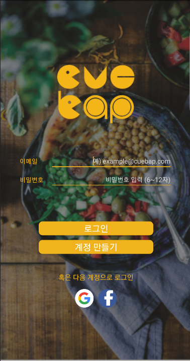
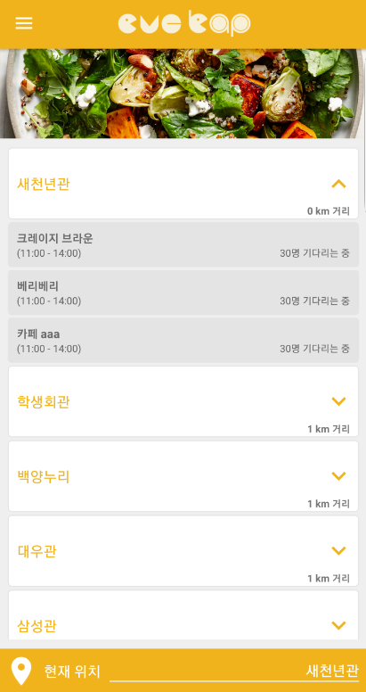
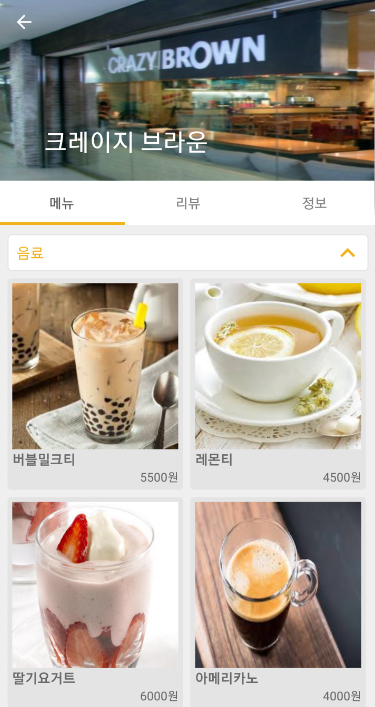
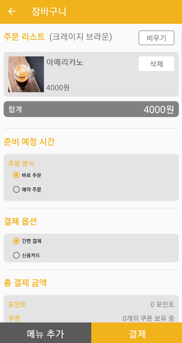
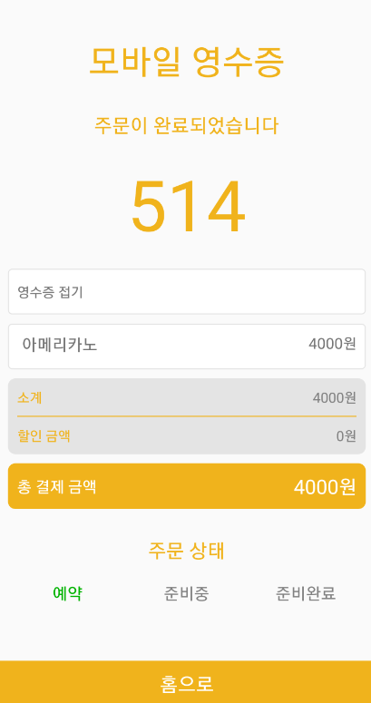

# Cuebap (큐밥)

[Play Store Link](https://play.google.com/store/apps/details?id=com.jinoolee.cuebap)

[APK Download Link](https://jinoolee-aws-s3.s3.ap-northeast-2.amazonaws.com/cuebap-release-1.0.1.apk)

    

  

Cuebap is an on-demand meal ordering and delivery platform that aims to optimize the eating experiences of college students and faculty, simultaneously allowing restaurants to see greater efficiency and enjoy more sales. The idea rose from accumulated inefficient use of time students have been experiencing due to long queues, which leads to 1 out of 3 students skipping meals. We aim to create value for college campuses by offering pre-order system through providing real time data that people are seeking all the time, to have daily impact on their lives.

Cuebap partners with local merchants to ensure inventory optimization by predicting how many orders to expect and know customers’ preferences. Cuebap will not only offer convenient service that saves time but also provide an ecosystem that encompasses the entire shopping experience, from ordering to inventory management.

*A Frontend-only application, created on commission as part of a capstone project in the Techno-Art Divison at Yonsei University.*

큐밥은 대학 캠퍼스 내 음식 주문 및 배달 O2O 플랫폼으로, 대학생 및 교직원의 식문화를 개선하고 교내 식당의 보다 효율적인 운영과 늘어난 매출을 지향합니다. 학생들이 교내 식당에서 긴 줄을 서면서 비효율적으로 시간을 쓰고, 이로 인해 학생 3명 중 1명은 식사를 거르는 현상에서 영감을 얻은 큐밥은 대학교 캠퍼스에 사전주문 시스템을 통한 실시간 데이터를 제공하면서 가치를 제공합니다.

큐밥은 지역 상점들과의 파트너쉽을 통해 주문의 개수와 고객 성향을 파악하며 재고 관리에 주력합니다. 큐밥은 편리한 서비스를 통해 시간을 절약할 뿐만 아니라 주문에서부터 재고 관리까지 모두 아우르는 식사 문화 생태계를 제공합니다.

*연세대학교 테크노아트학부 캡스톤 프로젝트 작품으로, 프론트엔드 부분 구현 앱입니다.*